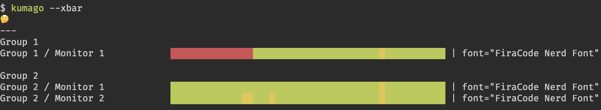

# Kumago

> Simple golang tool used to fetch the current state of a dashboard

## xbar

It supports xbar:

## Discord

As well as discord notifications

> Note: the goal of the discord notification is to get a synthesis of the down monitors
>
> Given that my notifications are sometime spammed, it can get difficult to track which monitors are down with the discord notifications.
> So I configured `kumago` in a daily cron that gives me a daily synthesis of the down monitors

> Note: Other notification services might work as it uses [shoutrrr](https://github.com/containrrr/shoutrrr) under the hood
